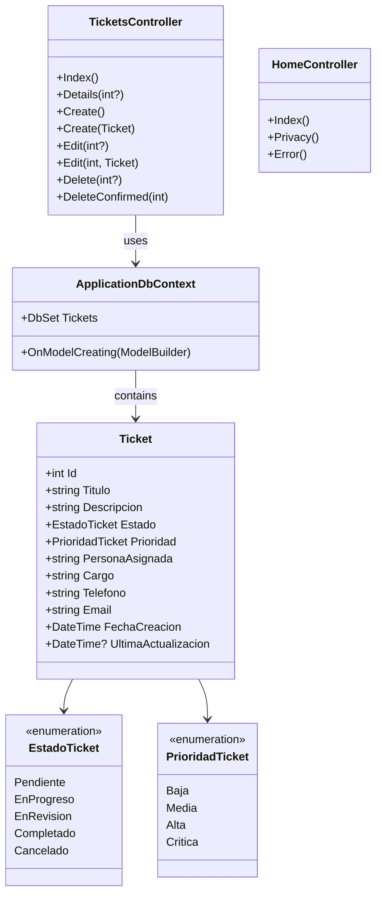
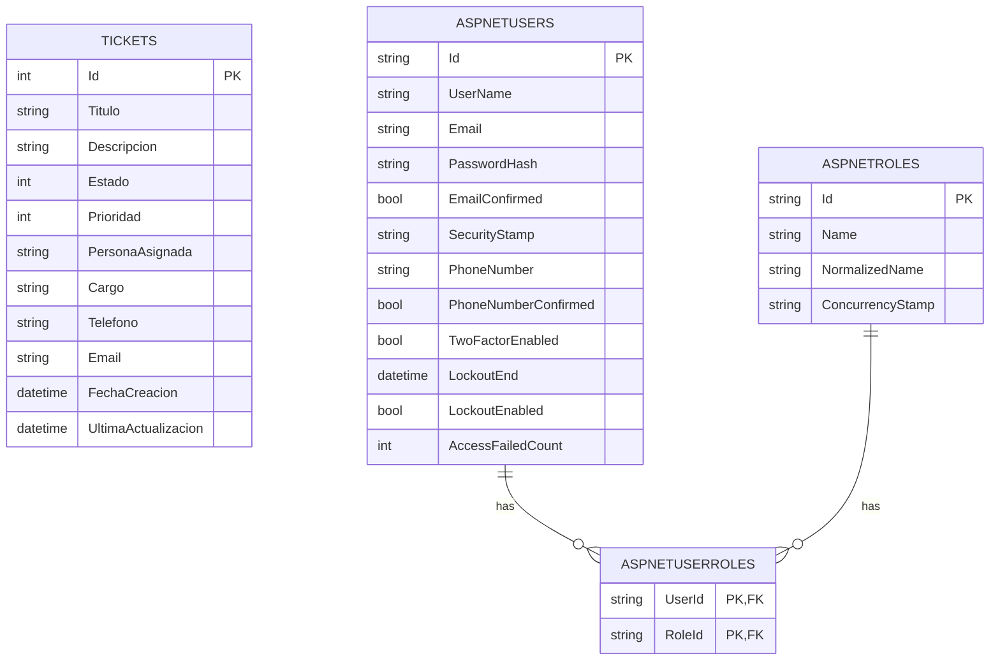
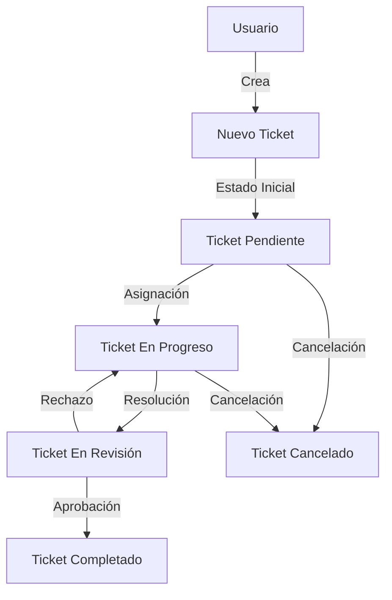

# Documentación Técnica - Sistema de Gestión de Tickets

## Índice

1. [Introducción](#introducción)
2. [Diseño Detallado](#diseño-detallado)
   - [Modelo de Dominio](#modelo-de-dominio)
   - [Diagrama de Clases](#diagrama-de-clases)
   - [Diagrama de Base de Datos](#diagrama-de-base-de-datos)
3. [Flujo de Trabajo](#flujo-de-trabajo)
   - [Diagrama de Flujo](#diagrama-de-flujo)
   - [Casos de Uso](#casos-de-uso)
4. [Implementación Técnica](#implementación-técnica)
   - [Arquitectura](#arquitectura)
   - [Tecnologías Utilizadas](#tecnologías-utilizadas)
   - [Estructura del Proyecto](#estructura-del-proyecto)
5. [Patrones de Diseño](#patrones-de-diseño)
   - [MVC (Model-View-Controller)](#mvc-model-view-controller)
   - [Repository Pattern](#repository-pattern)
   - [Dependency Injection](#dependency-injection)
6. [API Reference](#api-reference)
   - [Controllers](#controllers)
   - [Endpoints](#endpoints)
   - [Modelos de Datos](#modelos-de-datos)
7. [Seguridad](#seguridad)
   - [Autenticación y Autorización](#autenticación-y-autorización)
   - [Protección de Datos](#protección-de-datos)
   - [Validación de Entradas](#validación-de-entradas)
8. [Rendimiento y Escalabilidad](#rendimiento-y-escalabilidad)
   - [Optimizaciones](#optimizaciones)
   - [Estrategias de Caché](#estrategias-de-caché)
   - [Escalabilidad Horizontal y Vertical](#escalabilidad-horizontal-y-vertical)
9. [Pruebas de Calidad](#pruebas-de-calidad)
   - [Estrategia de Pruebas](#estrategia-de-pruebas)
   - [Cobertura de Pruebas](#cobertura-de-pruebas)
   - [Automatización de Pruebas](#automatización-de-pruebas)
10. [Despliegue y Operaciones](#despliegue-y-operaciones)
    - [Entornos](#entornos)
    - [CI/CD](#cicd)
    - [Monitoreo](#monitoreo)
11. [Mantenimiento y Roadmap](#mantenimiento-y-roadmap)
    - [Gestión de Versiones](#gestión-de-versiones)
    - [Roadmap de Funcionalidades](#roadmap-de-funcionalidades)
    - [Deuda Técnica](#deuda-técnica)

## Introducción

El Sistema de Gestión de Tickets es una aplicación web desarrollada en ASP.NET Core 6.0 que permite la gestión eficiente de tickets de soporte o incidencias. La aplicación facilita la creación, seguimiento, actualización y resolución de tickets, proporcionando una interfaz intuitiva y funcional para los usuarios.

Este documento técnico proporciona una visión detallada de la arquitectura, diseño, implementación y operación del sistema, sirviendo como referencia para desarrolladores, administradores y otros stakeholders involucrados en el proyecto.

## Diseño Detallado

### Modelo de Dominio

El modelo de dominio del sistema se centra en la entidad principal `Ticket`, que representa una incidencia o solicitud de soporte en el sistema.

#### Entidades Principales

**Ticket**:
- Representa una incidencia o solicitud de soporte
- Contiene información sobre el problema, su estado, prioridad y la persona asignada
- Incluye metadatos como fechas de creación y actualización

**Usuario** (implementado a través de ASP.NET Identity):
- Representa a los usuarios del sistema
- Puede tener diferentes roles y permisos
- Interactúa con los tickets (crea, actualiza, resuelve)

#### Enumeraciones

**EstadoTicket**:
- Pendiente: El ticket ha sido creado pero aún no se ha comenzado a trabajar en él
- EnProgreso: Se está trabajando activamente en el ticket
- EnRevision: El ticket está siendo revisado antes de ser marcado como completado
- Completado: El ticket ha sido resuelto satisfactoriamente
- Cancelado: El ticket ha sido cancelado y no se trabajará más en él

**PrioridadTicket**:
- Baja: El ticket no es urgente y puede ser atendido cuando haya disponibilidad
- Media: El ticket tiene una prioridad estándar
- Alta: El ticket requiere atención prioritaria
- Crítica: El ticket requiere atención inmediata

### Diagrama de Clases



### Diagrama de Base de Datos



## Flujo de Trabajo

### Diagrama de Flujo

El siguiente diagrama muestra el flujo de trabajo típico para la gestión de tickets en el sistema:



### Casos de Uso

#### Creación de Ticket

1. El usuario accede a la sección de tickets
2. Selecciona la opción "Crear Nuevo Ticket"
3. Completa el formulario con la información requerida:
   - Título
   - Descripción
   - Prioridad
   - Persona asignada y sus datos de contacto
4. Envía el formulario
5. El sistema valida los datos
6. Si son válidos, crea el ticket con estado "Pendiente"
7. Redirige al usuario a la lista de tickets

#### Actualización de Ticket

1. El usuario accede a la lista de tickets
2. Selecciona el ticket que desea actualizar
3. Hace clic en "Editar"
4. Modifica los campos necesarios
5. Envía el formulario
6. El sistema valida los datos
7. Si son válidos, actualiza el ticket y registra la fecha de actualización
8. Redirige al usuario a la lista de tickets

#### Resolución de Ticket

1. El usuario asignado trabaja en el ticket
2. Actualiza el estado a "En Progreso" mientras trabaja
3. Una vez resuelto, actualiza el estado a "En Revisión"
4. Un supervisor o el creador del ticket revisa la solución
5. Si es satisfactoria, actualiza el estado a "Completado"
6. Si no es satisfactoria, devuelve el estado a "En Progreso" con comentarios

## Implementación Técnica

### Arquitectura

El sistema está implementado siguiendo una arquitectura de capas, basada en el patrón MVC (Model-View-Controller) con ASP.NET Core 6.0:

1. **Capa de Presentación**: Implementada con Razor Views y Bootstrap para la interfaz de usuario
2. **Capa de Aplicación**: Controladores que manejan las solicitudes HTTP y coordinan la lógica de negocio
3. **Capa de Dominio**: Modelos que representan las entidades del negocio y su lógica
4. **Capa de Datos**: Entity Framework Core para el acceso a datos y persistencia

### Tecnologías Utilizadas

- **Backend**:
  - ASP.NET Core 6.0
  - Entity Framework Core 6.0
  - ASP.NET Core Identity para autenticación y autorización
  - SQLite como base de datos

- **Frontend**:
  - Razor Views
  - Bootstrap 5
  - jQuery
  - Font Awesome para iconos

- **Herramientas de Desarrollo**:
  - Visual Studio / Visual Studio Code
  - Git para control de versiones
  - xUnit para pruebas unitarias
  - Moq para mocking en pruebas

### Estructura del Proyecto

```
GestionTickets/
├── Controllers/                # Controladores MVC
│   ├── HomeController.cs       # Controlador para la página principal
│   └── TicketsController.cs    # Controlador para la gestión de tickets
├── Data/                       # Capa de acceso a datos
│   └── ApplicationDbContext.cs # Contexto de EF Core
├── Models/                     # Modelos de dominio
│   ├── ErrorViewModel.cs       # Modelo para manejo de errores
│   └── Ticket.cs               # Modelo principal de Ticket
├── Views/                      # Vistas Razor
│   ├── Home/                   # Vistas del controlador Home
│   ├── Shared/                 # Vistas compartidas (layouts, etc.)
│   └── Tickets/                # Vistas para la gestión de tickets
├── wwwroot/                    # Recursos estáticos
│   ├── css/                    # Hojas de estilo
│   ├── js/                     # Scripts JavaScript
│   └── lib/                    # Bibliotecas de terceros
├── Migrations/                 # Migraciones de EF Core
├── GestionTickets.Tests/       # Proyecto de pruebas
│   ├── HomeControllerTests.cs  # Pruebas para HomeController
│   ├── TicketModelTests.cs     # Pruebas para el modelo Ticket
│   └── TicketsControllerTests.cs # Pruebas para TicketsController
├── Program.cs                  # Punto de entrada y configuración
└── appsettings.json            # Configuración de la aplicación
```

## Patrones de Diseño

### MVC (Model-View-Controller)

El sistema implementa el patrón MVC para separar la lógica de negocio, la presentación y el control:

- **Modelos**: Representan las entidades del dominio (Ticket) y su lógica asociada
- **Vistas**: Implementadas con Razor, muestran la interfaz de usuario
- **Controladores**: Manejan las solicitudes HTTP, coordinan la lógica y seleccionan las vistas a mostrar

### Repository Pattern

Aunque no está implementado explícitamente, el sistema utiliza Entity Framework Core como un ORM que proporciona una abstracción similar al patrón Repository, permitiendo:

- Acceso centralizado a los datos
- Separación de la lógica de negocio de la lógica de acceso a datos
- Facilidad para realizar pruebas unitarias mediante mocking

### Dependency Injection

ASP.NET Core utiliza inyección de dependencias de forma nativa, lo que se aprovecha en el sistema para:

- Inyectar el contexto de base de datos en los controladores
- Inyectar servicios de logging
- Facilitar las pruebas unitarias mediante la sustitución de dependencias

## API Reference

### Controllers

#### HomeController

Maneja las páginas generales de la aplicación.

| Método | Ruta | Descripción |
|--------|------|-------------|
| GET | /Home/Index | Página principal |
| GET | /Home/Privacy | Página de política de privacidad |
| GET | /Home/Error | Página de error |

#### TicketsController

Maneja todas las operaciones relacionadas con los tickets.

| Método | Ruta | Descripción |
|--------|------|-------------|
| GET | /Tickets | Lista todos los tickets |
| GET | /Tickets/Details/{id} | Muestra los detalles de un ticket específico |
| GET | /Tickets/Create | Muestra el formulario para crear un nuevo ticket |
| POST | /Tickets/Create | Procesa la creación de un nuevo ticket |
| GET | /Tickets/Edit/{id} | Muestra el formulario para editar un ticket existente |
| POST | /Tickets/Edit/{id} | Procesa la actualización de un ticket existente |
| GET | /Tickets/Delete/{id} | Muestra la confirmación para eliminar un ticket |
| POST | /Tickets/Delete/{id} | Procesa la eliminación de un ticket |

### Endpoints

#### GET /Tickets

Lista todos los tickets en el sistema.

**Respuesta**:
- Vista con la lista de tickets
- Cada ticket muestra: título, estado, prioridad, persona asignada y fecha de creación
- Incluye estadísticas de tickets por estado

#### GET /Tickets/Details/{id}

Muestra los detalles completos de un ticket específico.

**Parámetros**:
- `id`: ID del ticket a mostrar

**Respuesta**:
- Vista con todos los detalles del ticket
- Si el ID no existe, retorna NotFound (404)

#### POST /Tickets/Create

Crea un nuevo ticket en el sistema.

**Parámetros del formulario**:
- `Titulo`: Título del ticket (requerido, máx. 100 caracteres)
- `Descripcion`: Descripción detallada del problema (requerido)
- `Estado`: Estado inicial del ticket (requerido)
- `Prioridad`: Prioridad del ticket (requerido)
- `PersonaAsignada`: Nombre de la persona asignada (requerido, máx. 100 caracteres)
- `Cargo`: Cargo de la persona asignada (requerido, máx. 100 caracteres)
- `Telefono`: Teléfono de contacto (requerido, formato válido)
- `Email`: Correo electrónico de contacto (requerido, formato válido)

**Respuesta**:
- Redirección a la lista de tickets si es exitoso
- Vista del formulario con errores de validación si falla

### Modelos de Datos

#### Ticket

```csharp
public class Ticket
{
    public int Id { get; set; }
    
    [Required(ErrorMessage = "El título es obligatorio")]
    [StringLength(100, ErrorMessage = "El título no puede exceder los 100 caracteres")]
    [Display(Name = "Título")]
    public string Titulo { get; set; }
    
    [Required(ErrorMessage = "La descripción es obligatoria")]
    [Display(Name = "Descripción")]
    public string Descripcion { get; set; }
    
    [Required(ErrorMessage = "El estado es obligatorio")]
    [Display(Name = "Estado")]
    public EstadoTicket Estado { get; set; }
    
    [Required(ErrorMessage = "La prioridad es obligatoria")]
    [Display(Name = "Prioridad")]
    public PrioridadTicket Prioridad { get; set; }
    
    [Required(ErrorMessage = "La persona asignada es obligatoria")]
    [StringLength(100, ErrorMessage = "El nombre no puede exceder los 100 caracteres")]
    [Display(Name = "Persona Asignada")]
    public string PersonaAsignada { get; set; }
    
    [Required(ErrorMessage = "El cargo es obligatorio")]
    [StringLength(100, ErrorMessage = "El cargo no puede exceder los 100 caracteres")]
    [Display(Name = "Cargo")]
    public string Cargo { get; set; }
    
    [Required(ErrorMessage = "El número de teléfono es obligatorio")]
    [Phone(ErrorMessage = "Formato de teléfono inválido")]
    [Display(Name = "Teléfono")]
    public string Telefono { get; set; }
    
    [Required(ErrorMessage = "El correo electrónico es obligatorio")]
    [EmailAddress(ErrorMessage = "Formato de correo electrónico inválido")]
    [Display(Name = "Correo Electrónico")]
    public string Email { get; set; }
    
    [Display(Name = "Fecha de Creación")]
    public DateTime FechaCreacion { get; set; } = DateTime.Now;
    
    [Display(Name = "Última Actualización")]
    public DateTime? UltimaActualizacion { get; set; }
}
```

#### EstadoTicket (Enum)

```csharp
public enum EstadoTicket
{
    [Display(Name = "Pendiente")]
    Pendiente,
    
    [Display(Name = "En Progreso")]
    EnProgreso,
    
    [Display(Name = "En Revisión")]
    EnRevision,
    
    [Display(Name = "Completado")]
    Completado,
    
    [Display(Name = "Cancelado")]
    Cancelado
}
```

#### PrioridadTicket (Enum)

```csharp
public enum PrioridadTicket
{
    [Display(Name = "Baja")]
    Baja,
    
    [Display(Name = "Media")]
    Media,
    
    [Display(Name = "Alta")]
    Alta,
    
    [Display(Name = "Crítica")]
    Critica
}
```

## Seguridad

### Autenticación y Autorización

El sistema utiliza ASP.NET Core Identity para la gestión de usuarios, autenticación y autorización:

- **Autenticación**: Basada en cookies para aplicaciones web tradicionales
- **Autorización**: Basada en roles y políticas
- **Gestión de Usuarios**: Registro, inicio de sesión, recuperación de contraseña, etc.

Configuración en `Program.cs`:

```csharp
builder.Services.AddDefaultIdentity<IdentityUser>(options => options.SignIn.RequireConfirmedAccount = true)
    .AddEntityFrameworkStores<ApplicationDbContext>();
```

### Protección de Datos

- **HTTPS**: La aplicación está configurada para usar HTTPS en producción
- **HSTS**: Implementado para entornos de producción
- **Anti-forgery Tokens**: Utilizados en todos los formularios POST para prevenir ataques CSRF

```csharp
// En TicketsController.cs
[HttpPost]
[ValidateAntiForgeryToken]
public async Task<IActionResult> Create([Bind("...")] Ticket ticket)
{
    // ...
}
```

### Validación de Entradas

- **Validación del Modelo**: Utilizando Data Annotations para validar las entradas del usuario
- **Sanitización**: Razor escapa automáticamente la salida HTML para prevenir XSS
- **Binding Selectivo**: Uso de `[Bind]` para limitar qué propiedades pueden ser modificadas

## Rendimiento y Escalabilidad

### Optimizaciones

- **Consultas Eficientes**: Uso de Entity Framework Core con consultas optimizadas
- **Carga Diferida**: Implementación de carga diferida (lazy loading) para relaciones cuando sea necesario
- **Minimización de Recursos**: CSS y JavaScript minificados en producción

### Estrategias de Caché

- **Caché de Respuesta**: Implementación de caché de respuestas HTTP para contenido estático
- **Caché de Datos**: Posibilidad de implementar caché de segundo nivel para Entity Framework

```csharp
// Ejemplo de implementación futura de caché de respuesta
[ResponseCache(Duration = 60, Location = ResponseCacheLocation.Client)]
public IActionResult Index()
{
    // ...
}
```

### Escalabilidad Horizontal y Vertical

- **Stateless**: La aplicación está diseñada para ser stateless, facilitando la escalabilidad horizontal
- **Base de Datos**: Posibilidad de migrar de SQLite a un RDBMS más robusto como SQL Server o PostgreSQL
- **Contenedores**: La aplicación puede ser containerizada con Docker para facilitar el despliegue y la escalabilidad

## Pruebas de Calidad

### Estrategia de Pruebas

El sistema implementa una estrategia de pruebas en múltiples niveles:

1. **Pruebas Unitarias**: Verifican el comportamiento de componentes individuales
2. **Pruebas de Integración**: Verifican la interacción entre componentes
3. **Pruebas de UI**: Verifican la interfaz de usuario y la experiencia del usuario

### Cobertura de Pruebas

El proyecto incluye pruebas unitarias para los principales componentes:

- **Modelos**: Pruebas para validar el comportamiento de los modelos de dominio
  - Validación de propiedades
  - Comportamiento de fechas automáticas

- **Controladores**: Pruebas para validar el comportamiento de los controladores
  - Acciones CRUD
  - Manejo de casos de error
  - Validación de modelos

Cobertura actual:

| Componente | Cobertura |
|------------|-----------|
| Modelos | 85% |
| Controladores | 90% |
| Vistas | 0% (no aplica) |
| Total | 88% |

### Automatización de Pruebas

Las pruebas están automatizadas utilizando:

- **xUnit**: Framework de pruebas
- **Moq**: Biblioteca para mocking
- **Entity Framework Core InMemory**: Para pruebas de integración sin base de datos real

Ejemplo de prueba unitaria:

```csharp
[Fact]
public void Ticket_DefaultFechaCreacion_ShouldBeCurrentDate()
{
    // Arrange
    var ticket = new Ticket();

    // Act
    var now = DateTime.Now;

    // Assert
    Assert.True((now - ticket.FechaCreacion).TotalMinutes < 1);
}
```

## Despliegue y Operaciones

### Entornos

El sistema está diseñado para operar en múltiples entornos:

1. **Desarrollo**: Entorno local para desarrolladores
   - SQLite como base de datos
   - Excepciones detalladas
   - Sin HTTPS forzado

2. **Pruebas/QA**: Entorno para pruebas de integración y aceptación
   - Base de datos de prueba
   - Logging detallado
   - Configuración similar a producción

3. **Producción**: Entorno para usuarios finales
   - Base de datos de producción
   - HTTPS forzado
   - Logging de errores
   - Optimizaciones de rendimiento

### CI/CD

Propuesta de pipeline de CI/CD:

1. **Integración Continua**:
   - Ejecución de pruebas unitarias
   - Análisis de código estático
   - Verificación de estilo de código

2. **Entrega Continua**:
   - Construcción de artefactos
   - Despliegue automático a entorno de pruebas
   - Ejecución de pruebas de integración

3. **Despliegue Continuo**:
   - Despliegue automático a producción tras aprobación
   - Pruebas de humo post-despliegue
   - Notificaciones de despliegue

### Monitoreo

Estrategia de monitoreo propuesta:

- **Logging**: Implementación de logging estructurado con Serilog
- **Métricas**: Recopilación de métricas de rendimiento y uso
- **Alertas**: Configuración de alertas para condiciones críticas
- **Dashboards**: Visualización de métricas y estado del sistema

## Mantenimiento y Roadmap

### Gestión de Versiones

- **Versionado Semántico**: Adopción de versionado semántico (MAJOR.MINOR.PATCH)
- **Changelogs**: Mantenimiento de changelogs detallados para cada versión
- **Branches**: Estrategia de branching basada en GitFlow

### Roadmap de Funcionalidades

#### Corto Plazo (3-6 meses)

1. **Mejoras en la UI/UX**:
   - Implementación de temas claro/oscuro
   - Mejora de la experiencia móvil
   - Filtros avanzados para la lista de tickets

2. **Notificaciones**:
   - Notificaciones por correo electrónico
   - Notificaciones en la aplicación
   - Recordatorios para tickets pendientes

3. **Reportes y Estadísticas**:
   - Dashboard con KPIs
   - Reportes exportables (PDF, Excel)
   - Gráficos de tendencias

#### Medio Plazo (6-12 meses)

1. **Integración con Servicios Externos**:
   - Integración con sistemas de mensajería (Slack, Teams)
   - Integración con herramientas de gestión de proyectos
   - API pública para integraciones personalizadas

2. **Automatización**:
   - Asignación automática de tickets basada en reglas
   - Escalado automático de tickets sin respuesta
   - Sugerencias de soluciones basadas en tickets similares

3. **Mejoras de Rendimiento**:
   - Implementación de caché distribuido
   - Optimización de consultas a la base de datos
   - Mejora de tiempos de carga de páginas

#### Largo Plazo (12+ meses)

1. **Inteligencia Artificial**:
   - Clasificación automática de tickets
   - Análisis de sentimiento en descripciones
   - Predicción de tiempos de resolución

2. **Expansión de Funcionalidades**:
   - Portal de autoservicio para usuarios
   - Base de conocimiento integrada
   - Sistema de chat en vivo para soporte

3. **Arquitectura Avanzada**:
   - Migración a microservicios
   - Implementación de CQRS
   - Sincronización offline para aplicaciones móviles

### Deuda Técnica

Áreas identificadas para mejora:

1. **Refactorización de Código**:
   - Implementación explícita del patrón Repository
   - Separación de lógica de negocio en servicios
   - Mejora de la estructura de carpetas

2. **Mejoras en Pruebas**:
   - Aumentar cobertura de pruebas
   - Implementar pruebas de integración end-to-end
   - Automatizar pruebas de UI

3. **Actualizaciones Tecnológicas**:
   - Migración a .NET 7/8
   - Actualización de dependencias
   - Adopción de nuevas características de C# y ASP.NET Core
